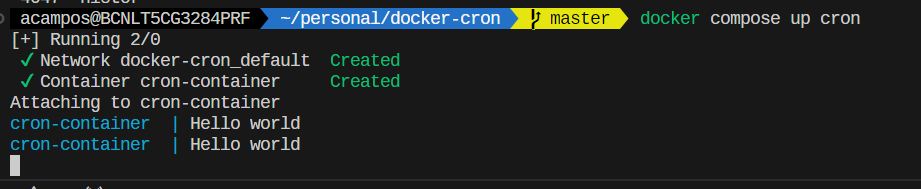
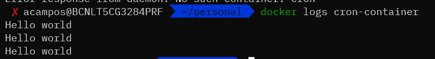

# Cron Docker :whale2:

Dive into this repository to unlock the secrets of running basic cron jobs inside a Docker container. All it takes is few minutes and few simple steps. 

Embrace the power of Dockerized Cron Jobs! :whale2::clock10:

:one: Build the image defined on [Dockerfile](Dockerfile):

```bash
docker build -t cron-container .
```

:two: Run the container using the [docker-compose.yaml](docker-compose.yaml) file:

```bash
docker compose up cron
```

You will have your container reading everytime the content of the file the cron is writing, so if you are patient. In one minute you will see the results:



As well, as the cron is writting into the stdout and stderr of the container you can see the 'Hello World' checking the container logs:

```bash
docker compose up -d cron
```

```bash
docker logs cron-container
```




Or inside the container file:
```bash
docker exec cron-container tail -f /var/log/cron.log
```
